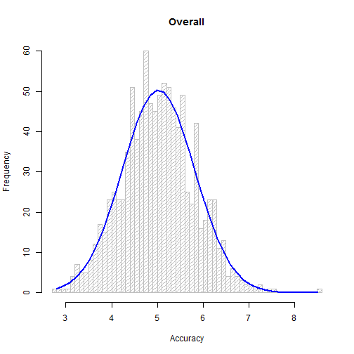

# Assignment Number 1 - Part A

### Set up steps

Set up the values for the simulation

```r
set.seed(667)
sims <- 1000
n <- 40
lambda <- 0.2
```

Create a Matrix of the values for better visualization.

```r
sim <- matrix(rexp(sims * n, rate = lambda), sims)
```


### Question 1: Show the sample mean and compare it to the theoretical mean of the distribution.

Take the mean for each row

```r
row_means<-rowMeans(sim)
mean(row_means)
```

```
## [1] 5.025859
```

The theoretical mean of the sample:

```r
1/lambda
```

```
## [1] 5
```


### Question 2: Show how variable the sample is (via variance) and compare it to the theoretical variance of the distribution.

Calculate the sd of each rowMeans

```r
(1/lambda)^2/n
```

```
## [1] 0.625
```

The theoretical sd

```r
var(row_means)
```

```
## [1] 0.6286297
```


## Question 3: Show that the distribution is approximately normal.

This histogram visually shows how the exponential distribution closely resembles a curve of the Central Limit Theorum.

```r
h<-hist(means, breaks=50, density=20, col="gray", xlab="Accuracy", main="Overall")
    xfit<-seq(min(means),max(means),length=40)
    yfit<-dnorm(xfit,mean=mean(means),sd=sd(means))
    yfit <- yfit*diff(h$mids[1:2])*length(means)
    lines(xfit, yfit, col="blue", lwd=2)
```


