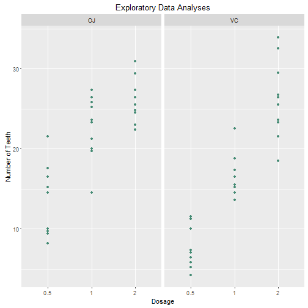

# Assignment Number 1 - Part B

First load the required libraries

```r
library(ggplot2)
library(datasets)
data(ToothGrowth)
```

Here are some basic exploratory data Analyses.

```r
str(ToothGrowth)
```

```
## 'data.frame':	60 obs. of  3 variables:
##  $ len : num  4.2 11.5 7.3 5.8 6.4 10 11.2 11.2 5.2 7 ...
##  $ supp: Factor w/ 2 levels "OJ","VC": 2 2 2 2 2 2 2 2 2 2 ...
##  $ dose: num  0.5 0.5 0.5 0.5 0.5 0.5 0.5 0.5 0.5 0.5 ...
```

```r
head(ToothGrowth)
```

```
##    len supp dose
## 1  4.2   VC  0.5
## 2 11.5   VC  0.5
## 3  7.3   VC  0.5
## 4  5.8   VC  0.5
## 5  6.4   VC  0.5
## 6 10.0   VC  0.5
```

```r
ToothGrowth$dose <- as.factor(ToothGrowth$dose)
table(ToothGrowth$supp, ToothGrowth$dose)
```

```
##     
##      0.5  1  2
##   OJ  10 10 10
##   VC  10 10 10
```

```r
summary(ToothGrowth)
```

```
##       len        supp     dose   
##  Min.   : 4.20   OJ:30   0.5:20  
##  1st Qu.:13.07   VC:30   1  :20  
##  Median :19.25           2  :20  
##  Mean   :18.81                   
##  3rd Qu.:25.27                   
##  Max.   :33.90
```

A point chart to start visualizing the outcome of the data.  We can get a general idea of what we may expect to see.

```r
ggplot(ToothGrowth, aes(x=dose, y=len))+geom_point(color="aquamarine4")+facet_wrap(~supp, nrow=1) +
     labs(x="Dosage", y="Number of Teeth")+  
     ggtitle("Exploratory Data Analyses")
```



We perform a variety of t-tests one for each dosage level.

95% confidence interval with dosage of .5
```r
AC = ToothGrowth$len[ToothGrowth$supp == 'VC' & ToothGrowth$dose == 0.5]
OJ = ToothGrowth$len[ToothGrowth$supp == 'OJ' & ToothGrowth$dose == 0.5]
t.test(AC,OJ)
```
Confidence interval: -8.780943 to -1.719057
Does not contain 0, therefore there is a 95% confidence in the difference between AC and OJ.

95% confidence interval with dosage of 1
```r
AC = ToothGrowth$len[ToothGrowth$supp == 'VC' & ToothGrowth$dose == 1]
OJ = ToothGrowth$len[ToothGrowth$supp == 'OJ' & ToothGrowth$dose == 1]
t.test(AC,OJ)
```
Confidence interval: -9.057852 to -2.802148
Does not contain 0, therefore there is a 95% confidence in the difference between AC and OJ.

95% confidence interval with dosage of 2
```r
AC = ToothGrowth$len[ToothGrowth$supp == 'VC' & ToothGrowth$dose == 2]
OJ = ToothGrowth$len[ToothGrowth$supp == 'OJ' & ToothGrowth$dose == 2]
t.test(AC,OJ)
```
Confidence interval: -3.63807 to 3.79807
Does contain 0, therefore we can not be confident in a difference between AC and OJ.


##Conclusion

At doses of 0.5 and 1.0 we can be confident that the treatment has made a difference.  However at the 2.0 dosage there is no evidence to suggest that the treatment made any difference.
