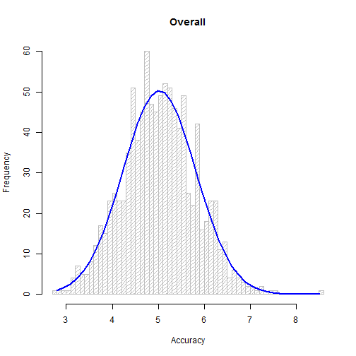
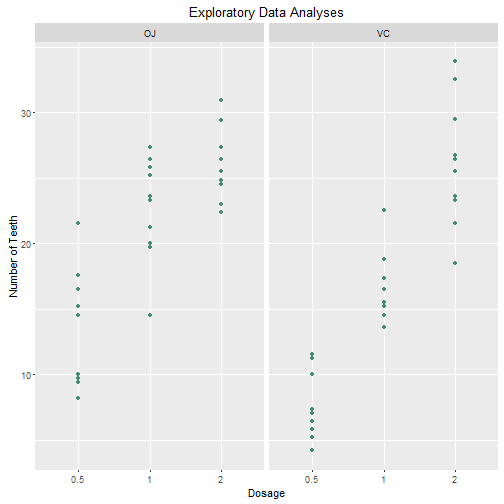

# Ass Number 1 - Part A


## Set up steps

### Set up the values for the simulation

```r
set.seed(667)
sims <- 1000
n <- 40
lambda <- 0.2
```

### Create a Matrix


```r
## create a matrix of a 1000 rows of 40 random exponential values
sim <- matrix(rexp(sims * n, rate = lambda), sims)
```


## 1. This is question number 1

### Take the mean for each row

```r
row_means<-rowMeans(sim)
mean(row_means)
```

```
## [1] 5.025859
```

### Theoretical mean of the sample:


```r
1/lambda
```

```
## [1] 5
```


## 2. This is question number 2

### take the sd of each rowMeans

```r
(1/lambda)^2/n
```

```
## [1] 0.625
```

### Theoretical sd

```r
var(row_means)
```

```
## [1] 0.6286297
```


## 3. This is question number 3

### This histogram visually shows how the ** resembles the **.


```r
h<-hist(means, breaks=50, density=20, col="gray", xlab="Accuracy", main="Overall")
    xfit<-seq(min(means),max(means),length=40)
    yfit<-dnorm(xfit,mean=mean(means),sd=sd(means))
    yfit <- yfit*diff(h$mids[1:2])*length(means)
    lines(xfit, yfit, col="blue", lwd=2)
```




# Ass Number 1 - Part B

First load the required libraries

```r
library(ggplot2)
library(datasets)
data(ToothGrowth)
```

Here are some basic exploratory data Analyses.

```r
str(ToothGrowth)
```

```
## 'data.frame':	60 obs. of  3 variables:
##  $ len : num  4.2 11.5 7.3 5.8 6.4 10 11.2 11.2 5.2 7 ...
##  $ supp: Factor w/ 2 levels "OJ","VC": 2 2 2 2 2 2 2 2 2 2 ...
##  $ dose: num  0.5 0.5 0.5 0.5 0.5 0.5 0.5 0.5 0.5 0.5 ...
```

```r
head(ToothGrowth)
```

```
##    len supp dose
## 1  4.2   VC  0.5
## 2 11.5   VC  0.5
## 3  7.3   VC  0.5
## 4  5.8   VC  0.5
## 5  6.4   VC  0.5
## 6 10.0   VC  0.5
```

```r
ToothGrowth$dose <- as.factor(ToothGrowth$dose)
table(ToothGrowth$supp, ToothGrowth$dose)
```

```
##     
##      0.5  1  2
##   OJ  10 10 10
##   VC  10 10 10
```

```r
summary(ToothGrowth)
```

```
##       len        supp     dose   
##  Min.   : 4.20   OJ:30   0.5:20  
##  1st Qu.:13.07   VC:30   1  :20  
##  Median :19.25           2  :20  
##  Mean   :18.81                   
##  3rd Qu.:25.27                   
##  Max.   :33.90
```

A point chart to start visualizing the outcome of the data

```r
ggplot(ToothGrowth, aes(x=dose, y=len))+geom_point(color="aquamarine4")+facet_wrap(~supp, nrow=1) +
     labs(x="Dosage", y="Number of Teeth")+  
     ggtitle("Exploratory Data Analyses")
```



We perform a t-test on the data to determine whether our null hypothesis can be rejected.

```r
v1 <- t.test(len~supp, paired=F, var.equal=T, data=ToothGrowth)
v2 <- t.test(len~supp, paired=F, var.equal=F, data=ToothGrowth)
Vresults <- data.frame("p-value"=c(v1$p.value, v2$p.value),
                          "Conf-Low"=c(v1$conf[1],v2$conf[1]),
                          "Conf-High"=c(v1$conf[2],v2$conf[2]),
                          row.names=c("Equal Var","Unequal Var"))
Vresults
```

```
##                p.value   Conf.Low Conf.High
## Equal Var   0.06039337 -0.1670064  7.567006
## Unequal Var 0.06063451 -0.1710156  7.571016
```
